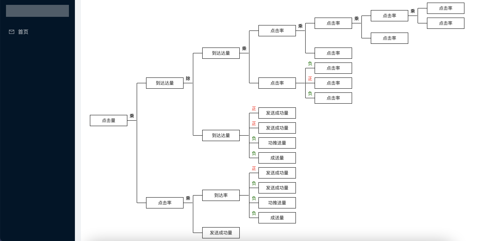
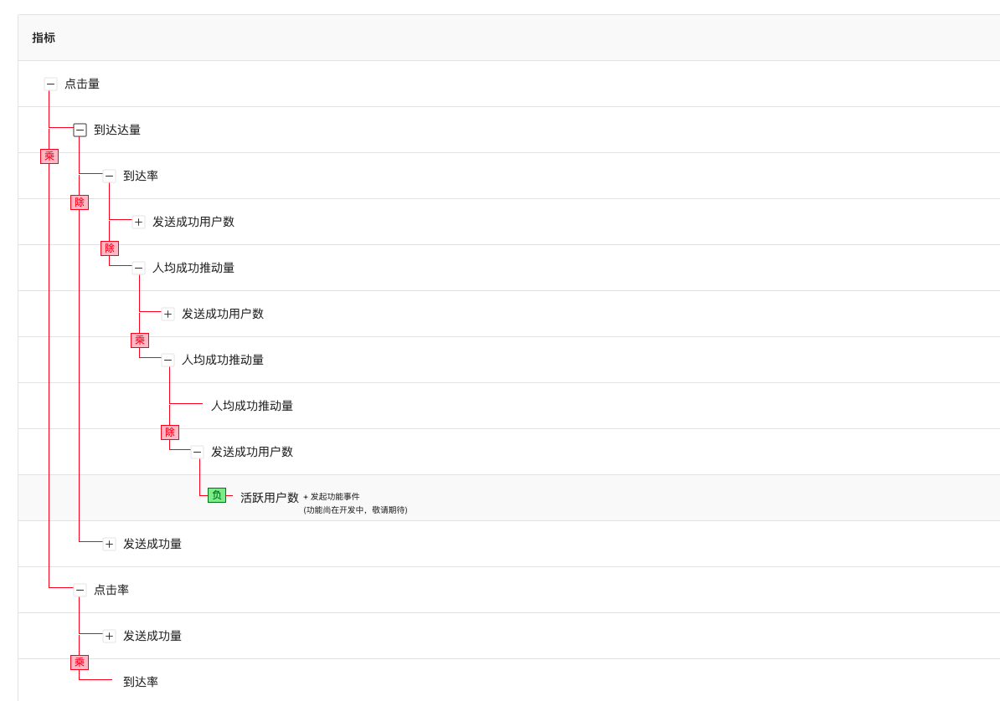
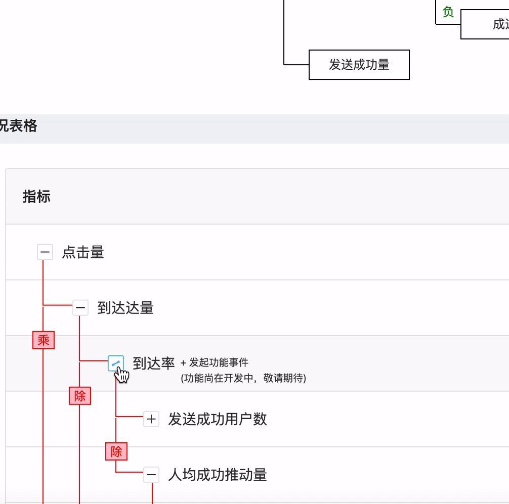

## tree-chart-table

- 树形图表。antd-table树形样式调整。

## 技术选型

- 编程语言：TypeScript
- 依赖管理：NPM
- 编码规范：@umijs/fabric + Prettier
- 开发框架：umi
- css框架：tailwindcss
- 状态管理：recoil
- UI 组件库：Ant Design + Ant Design Pro
- 日期处理：dayjs

## 项目结构

```
├─ .vscode                           # 编辑器配置
├─ doc                               # 文档
├─ mock                              # mock
└─ src
    ├─ common                        # 公共代码
    │  ├─ components                 # 公共组件
    │  ├─ types                      # 公共接口
    │  ├─ constants                  # 公共常量
    │  ├─ hooks                      # 公共hooks
    │  ├─ js                         # 公共工具库
    │  ├─ utils                      # 公共方法
    │  └─ style                      # 公共样式
    ├─ config                        # 页面路由配置等
    ├─ layouts                       # 页面布局
    ├─ pages                         # 页面模块
    └─ store                         # 状态管理
├── .cookie.json                    # cookies存放
├── .env                            # 环境变量
├── .eslintrc.js                    # 代码规范配置
├── .gitlab-ci.yml                  # gitlab ci配置
├── .npmrc                          # npm运行配置
├── .prettierrc.js                  # 代码格式配置
├── .stylelintrc.js                 # 样式规范配置
├── .umirc.ts                       # umi配置
├── app.ts                          # umi运行时配置文件
├── package-lock.json               # 插件集版本
├── package.json                    # 插件集
├── README.md                       # README.md
├── tailwind.config.ts              # tailwind配置
├── tsconfig.json                   # TS 配置
└── typings.d.ts                    # 声明文件
```

## 组件效果







## 使用说明

TreeChart 和 TreeTableChart 两个组件。直接将index.tsx 改为 index.js 也可以直接引入使用。

TreeChart 

根据层级数据，自适应平铺展开横向的树形图

TreeTableChart

在antd的table下，将树形结构的表格加上关系样式

### 安装依赖项

```bash
yarn or npm install
```

### 启动开发环境

```bash
npm start
```

### 调试

- npm run start

